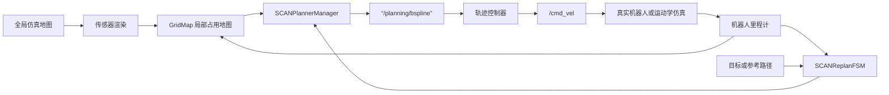
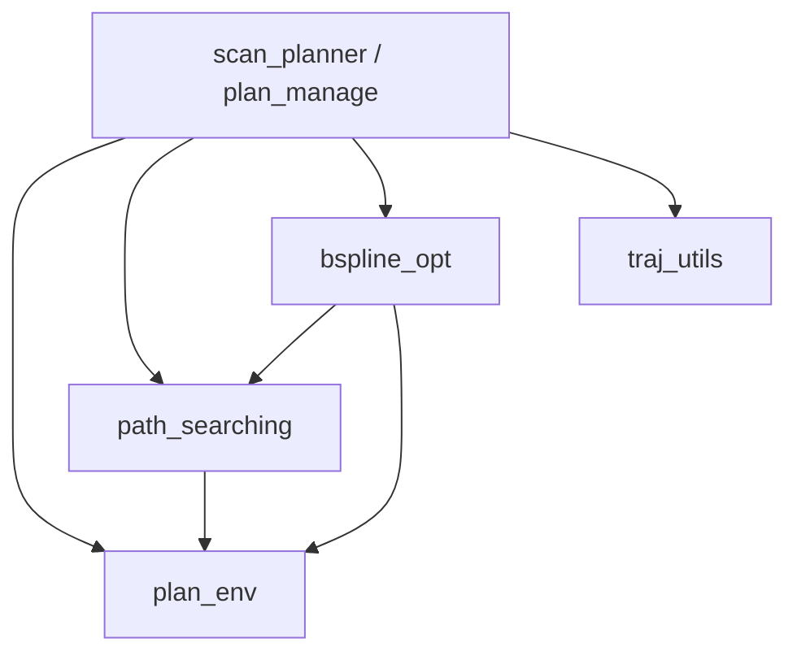
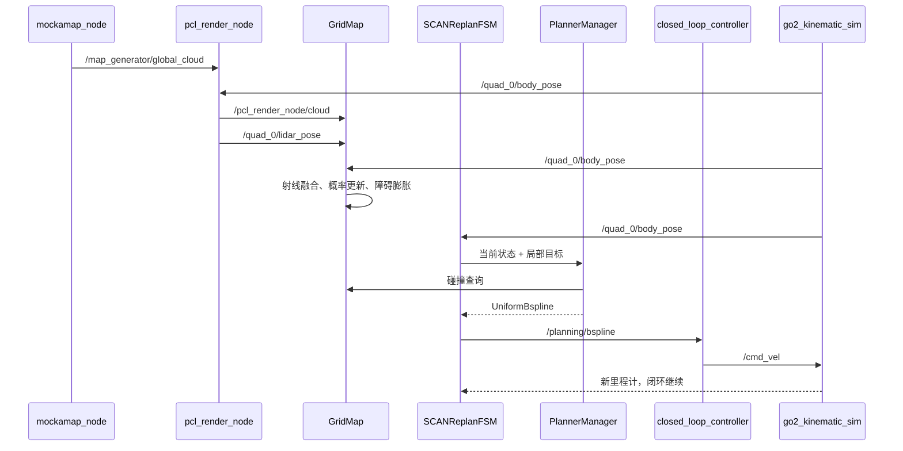
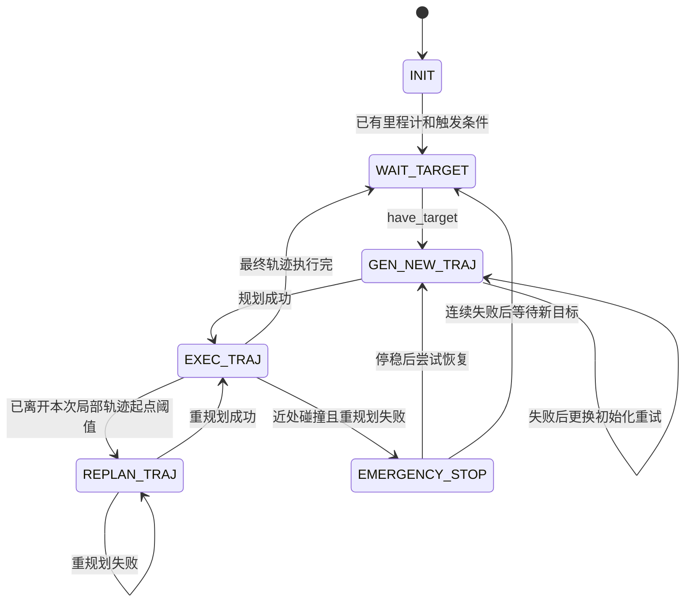

# SCAN-Planner 代码结构、数据流与开发指南

本文面向刚接触本项目的读者。目标是建立一张可以用于阅读、调试和二次开发的完整地图。

> 分析对象为当前工作区代码。项目仍可能继续演进；遇到文档与运行结果不一致时，以 launch 文件、话题连接和源码为准。

## 1. 先建立整体认识

SCAN-Planner 是一个四足机器人局部规划系统。它接收机器人位姿、传感器观测和导航目标，维护机器人附近的三维占用地图，持续生成无碰撞且满足速度、加速度约束的三次均匀 B 样条，再由控制器跟踪该轨迹。

系统的主闭环是：



需要先纠正两个容易产生的误解：

1. `planGlobalTraj()` 生成的是连接目标的多项式参考轨迹，不是基于完整地图进行的全局 A* 搜索。
2. A* 位于 B 样条优化器内部，主要为初始控制点中的碰撞区段寻找绕障方向，再由连续优化器生成平滑轨迹。

## 2. ROS 概念

### 2.1 Catkin 工作空间与包

当前仓库位于 catkin 工作空间中：

```text
catkin_ws/
├── src/       # 源码和各 ROS package
├── build/     # CMake 中间产物，不应手工修改
├── devel/     # 编译后的环境、库、可执行文件和生成消息
└── SCAN-Planner/
```

每个 ROS 包通常由 `package.xml` 声明依赖，由 `CMakeLists.txt` 定义编译目标。执行 `catkin_make` 后，需要运行：

```bash
source devel/setup.bash
```

这一步让当前终端能够找到本工作空间中的包、消息和节点。

### 2.2 节点、话题、消息、参数和 TF

- **节点（node）**：独立运行的进程，例如 `scan_planner_node`。
- **话题（topic）**：节点之间的异步数据通道，例如 `/planning/bspline`。
- **消息（message）**：话题上传输的数据结构，例如 `nav_msgs/Odometry`。
- **参数（parameter）**：运行时配置，由 launch 文件写入 ROS 参数服务器。
- **TF/坐标系**：描述 `world`、机器人机体和传感器之间的空间关系。
- **launch**：一次启动多个节点、设置参数、按条件选择节点并重映射话题。

话题名的 `remap` 很重要。源码可以订阅固定逻辑名称 `/grid_map/cloud`，launch 再把它连接到仿真或真实传感器话题，因此不能只搜索源码中的最终话题名。

## 3. 仓库结构与包职责

### 3.1 顶层目录

| 路径 | 用途 | 是否应修改 |
|---|---|---|
| `src/planner` | 规划、地图、搜索、轨迹和控制核心 | 二次开发重点 |
| `src/simulator` | 地图、传感器、机器人模型和 RViz 辅助 | 仿真开发重点 |
| `tools` | 多楼层关键点录制工具 | 按任务修改 |
| `assets` | README 图片和演示资源 | 通常不影响运行 |
| `build`、`devel` | catkin 自动生成 | 不要手工修改或提交 |

### 3.2 规划侧包

| ROS 包 | 目录 | 责任 | 核心源码 |
|---|---|---|---|
| `scan_planner` | `src/planner/plan_manage` | 节点入口、FSM、规划管理、控制器、自定义消息 | [scan_replan_fsm.cpp](../src/planner/plan_manage/src/scan_replan_fsm.cpp)、[planner_manager.cpp](../src/planner/plan_manage/src/planner_manager.cpp) |
| `plan_env` | `src/planner/plan_env` | 滑动占用栅格、射线融合、碰撞查询 | [grid_map.cpp](../src/planner/plan_env/src/grid_map.cpp)、[raycast.cpp](../src/planner/plan_env/src/raycast.cpp) |
| `path_searching` | `src/planner/path_searching` | 碰撞区段的三维 A* 搜索 | [dyn_a_star.cpp](../src/planner/path_searching/src/dyn_a_star.cpp) |
| `bspline_opt` | `src/planner/bspline_opt` | B 样条表示、控制点初始化、LBFGS 优化和可行性检查 | [bspline_optimizer.cpp](../src/planner/bspline_opt/src/bspline_optimizer.cpp)、[uniform_bspline.cpp](../src/planner/bspline_opt/src/uniform_bspline.cpp) |
| `traj_utils` | `src/planner/traj_utils` | 多项式轨迹与 RViz 可视化 | [polynomial_traj.cpp](../src/planner/traj_utils/src/polynomial_traj.cpp)、[planning_visualization.cpp](../src/planner/traj_utils/src/planning_visualization.cpp) |

核心依赖方向如下：



### 3.3 仿真和工具包

| ROS 包 | 责任 | 入口 |
|---|---|---|
| `mockamap` | 程序生成随机柱状或 Perlin 地图 | [mockamap.cpp](../src/simulator/mockamap/src/mockamap.cpp) |
| `map_generator` | 加载并周期发布 PCD 地图 | [map_publisher.cpp](../src/simulator/map_generator/src/map_publisher.cpp) |
| `local_sensing_node` | 从全局点云和机器人位姿模拟局部激光/深度观测 | [pointcloud_render_node.cpp](../src/simulator/local_sensing/src/pointcloud_render_node.cpp) |
| `go2_description` | Go2 URDF、mesh 和机器人显示配置 | [go2_description.urdf](../src/simulator/Utils/go2_description/urdf/go2_description.urdf) |
| `odom_visualization` | 将里程计转成 RViz 路径和 Marker | [odom_visualization.cpp](../src/simulator/Utils/odom_visualization/src/odom_visualization.cpp) |
| `waypoint_generator` | 交互式路点辅助工具 | [waypoint_generator.cpp](../src/simulator/Utils/waypoint_generator/src/waypoint_generator.cpp) |
| `pose_utils` | 位姿工具库 | [pose_utils.cpp](../src/simulator/Utils/pose_utils/src/pose_utils.cpp) |

`local_sensing_node` 默认编译 CPU/PCL 后端。`catkin_make -DUSE_GPU=ON` 会额外编译 OpenGL 后端，依赖 GLEW、GLFW、OpenGL 和 GLU。编译选项只决定 GPU 节点是否存在；运行时还要通过 `use_gpu` 选择它。

## 4. 启动过程

### 4.1 两个终端分别做什么

```bash
# 终端 1：只启动 RViz
source devel/setup.bash
roslaunch scan_planner rviz.launch

# 终端 2：启动算法、控制、模型和仿真
source devel/setup.bash
roslaunch scan_planner run.launch
```

[run.launch](../src/planner/plan_manage/launch/run.launch) 是系统总入口，[advanced_param.xml](../src/planner/plan_manage/launch/advanced_param.xml) 配置算法和主节点，[simulator.xml](../src/planner/plan_manage/launch/simulator.xml) 配置仿真数据源。

### 4.2 默认仿真的启动树

默认参数为 `is_real_world:=false`、`navi_mode:=1`、`sensor_type:=lidar`、`controller_mode:=closed_loop`：

```text
run.launch
├── advanced_param.xml
│   └── scan_planner_node
├── closed_loop_controller
├── go2_kinematic_sim
├── robot_state_publisher
├── go2_gait_publisher
└── simulator.xml
    ├── mockamap_node
    ├── odom_visualization
    └── pcl_render_node
```

条件分支：

- `controller_mode:=open_loop`：启动 `open_loop_controller`，不启动闭环控制器和运动学仿真器。
- `is_real_world:=true`：不启动地图生成、传感器渲染和运动学仿真，改接真实话题。
- `use_pcd_map:=true`：以 `map_pub` 替代 `mockamap_node`。
- `use_gpu:=true`：以 `opengl_render_node` 替代 `pcl_render_node`，前提是编译时启用了 GPU。

### 4.3 仿真与真机话题切换

| 逻辑数据 | 仿真话题 | 真机默认话题 |
|---|---|---|
| 机体位姿 | `/quad_0/body_pose` | `/LIO/odom_vehicle` |
| 传感器位姿 | `/quad_0/lidar_pose` 或 `/quad_0/camera_pose` | `/LIO/odom_imu` |
| 激光点云 | `/pcl_render_node/cloud` | `/LIO/clouds_lidar` |
| 深度图 | `/pcl_render_node/depth` | `/camera/aligned_depth_to_color/image_raw` |

这些连接在 [run.launch](../src/planner/plan_manage/launch/run.launch) 中计算，再传入 [advanced_param.xml](../src/planner/plan_manage/launch/advanced_param.xml) 完成 remap。

## 5. 节点与 ROS 数据接口

### 5.1 主规划节点 `scan_planner_node`

入口 [scan_planner_node.cpp](../src/planner/plan_manage/src/scan_planner_node.cpp) 很短：创建 `SCANReplanFSM`、调用 `init()`，然后 `ros::spin()`。真正逻辑都在 FSM、规划管理器和 GridMap 内。

订阅：

| 话题 | 类型 | 条件 | 用途 |
|---|---|---|---|
| `body_pose_topic` | `nav_msgs/Odometry` | 始终 | 当前机体位置、姿态和速度 |
| `/move_base_simple/goal` | `geometry_msgs/PoseStamped` | `navi_mode=1` | RViz 目标；代码使用初始机体高度作为目标 z |
| `/initial_path` | `nav_msgs/Path` | `navi_mode=3` | 外部参考路径，点的 z 会加 `body_height` |
| `/planning/go2_execution_frozen` | `std_msgs/Bool` | 始终 | 控制器转向冻结时暂停推进轨迹时钟 |
| `/grid_map/body_pose` | `nav_msgs/Odometry` | GridMap 内部 | 移动滑动地图中心 |
| `/grid_map/sensor_pose` | `nav_msgs/Odometry` | GridMap 内部 | 射线原点和传感器姿态 |
| `/grid_map/cloud` | `sensor_msgs/PointCloud2` | `sensor_type=lidar` | 点云观测 |
| `/grid_map/depth` | `sensor_msgs/Image` | `sensor_type=depth` | 深度观测，与传感器姿态近似同步 |

发布：

| 话题 | 类型 | 消费者/作用 |
|---|---|---|
| `/planning/bspline` | `scan_planner/Bspline` | 开环或闭环控制器 |
| `/planning/data_display` | `scan_planner/DataDisp` | 通用调试数据，目前字段语义未专门定义 |
| `self_inflation` | `visualization_msgs/Marker` | RViz 显示前后双圆柱碰撞模型 |
| `/grid_map/occupancy` | `sensor_msgs/PointCloud2` | RViz 显示占用体素 |
| `/grid_map/occupancy_inflate` | `sensor_msgs/PointCloud2` | RViz 显示膨胀占用体素 |
| `/grid_map/sliding_map_bbox` | `visualization_msgs/Marker` | RViz 显示局部地图边界 |
| `/grid_map/unknown` | `sensor_msgs/PointCloud2` | RViz 调试未知区域 |
| `/grid_map/depth_cloud` | `sensor_msgs/PointCloud2` | 深度投影调试 |
| `/grid_map/sensor_pose_extrinsic` | `nav_msgs/Odometry` | 外参修正后的传感器姿态调试 |

内部定时器：

| 周期 | 回调 | 作用 |
|---|---|---|
| 0.01 s / 100 Hz | `execFSMCallback()` | 状态机推进、规划与周期重规划 |
| 0.05 s / 20 Hz | `checkCollisionCallback()` | 预测当前轨迹前方碰撞并重规划/急停 |
| 0.05 s / 20 Hz | `GridMap::updateOccupancyCallback()` | 消费最新传感数据并融合地图 |
| 0.05 s / 20 Hz | `GridMap::visCallback()` | 发布地图可视化 |

### 5.2 控制和仿真节点

| 节点 | 订阅 | 发布 | 作用 |
|---|---|---|---|
| `closed_loop_controller` | `/planning/bspline`、机体里程计 | `/cmd_vel`、`/planning/go2_execution_frozen` | 根据轨迹前视点和实际位姿计算机体系速度 |
| `open_loop_controller` | `/planning/bspline` | `/quad_0/body_pose` | 直接沿样条生成理想里程计，适合多楼层展示，不模拟跟踪误差 |
| `go2_kinematic_sim` | `/cmd_vel` | `/quad_0/body_pose`、TF | 对速度指令积分形成仿真里程计 |
| `go2_gait_publisher` | `/quad_0/body_pose` | `/joint_states` | 生成用于 RViz 展示的简化对角小跑关节运动，不是实际腿部控制器 |
| `robot_state_publisher` | `/joint_states`、URDF | TF | 发布机身到各关节/连杆的模型 TF |
| `mockamap_node` | 无 | `/map_generator/global_cloud` | 生成完整仿真环境 |
| `pcl_render_node` | 全局地图、机体里程计 | 局部 cloud/depth、传感器 pose | 只渲染传感器当前可见数据 |

你提供的 RViz 图中灰色部分来自 `RobotModel` 的 visual geometry，红色/白色部分通常是 collision geometry 或 Marker。勾选 RobotModel 的 `Collision Enabled` 会显示 URDF 碰撞体；规划真正查询的是 GridMap 中按双圆柱模型膨胀后的体素，两者用途相关但不是同一份几何数据。

## 6. 自定义消息和关键数据结构

### 6.1 `scan_planner/Bspline`

定义见 [Bspline.msg](../src/planner/plan_manage/msg/Bspline.msg)：

| 字段 | 含义 |
|---|---|
| `order` | 样条次数；发布时为 3 |
| `traj_id` | 每次成功更新轨迹后递增，便于控制器识别新轨迹 |
| `start_time` | 轨迹时间零点 |
| `knots` | 节点向量 |
| `pos_pts` | 三维位置控制点 |
| `yaw_pts`、`yaw_dt` | 预留偏航样条字段；当前主规划发布路径未填充 |

控制器收到消息后重建 `UniformBspline`。速度和加速度不必通过消息发送，因为它们可由位置样条求一阶、二阶导数得到。

### 6.2 `LocalTrajData`

[plan_container.hpp](../src/planner/plan_manage/include/plan_manage/plan_container.hpp) 保存节点内当前局部轨迹：

- `position_traj_`：位置 B 样条；
- `velocity_traj_`：位置样条的一阶导；
- `acceleration_traj_`：二阶导；
- `start_time_`、`duration_`：时间基准和总时长；
- `start_pos_`：该次局部轨迹起点；
- `traj_id_`：轨迹编号。

### 6.3 `GlobalTrajData`

它保存多项式全局参考、总时长及局部目标推进状态。这里的“global”表示覆盖当前起点到最终目标的参考，不代表进行了全局障碍搜索。

## 7. 完整数据流

### 7.1 默认闭环仿真



全局地图不直接交给规划器。它先经过传感器渲染，规划器只看到机器人“当前能够感知到”的局部观测，这样才能模拟未知环境中的在线规划。

### 7.2 真机模式

真机模式删除仿真链，数据流变为：

```text
LIO 里程计/点云 或 深度相机
       ↓
GridMap + SCANReplanFSM
       ↓ /planning/bspline
closed_loop_controller
       ↓ /cmd_vel
真实机器人底层运动控制
```

项目只输出 `geometry_msgs/Twist`。把它接入真机前，必须核实底层是否接受同名话题、速度所属坐标系、单位、限幅、急停和通信超时；launch 中没有展示 Unitree SDK 到底盘的适配层。

### 7.3 三种导航模式

#### 模式 1：RViz 单目标

1. FSM 等到第一帧里程计，并记录机体 z 作为目标高度。
2. 用户通过 RViz `2D Nav Goal` 发布 `/move_base_simple/goal`。
3. `waypointCallback()` 生成起点到终点的多项式参考。
4. FSM 规划局部 B 样条并开始执行。
5. 每推进约 `thresh_replan` 距离后，从当前里程计刷新全局参考并重规划。

#### 模式 2：关键点序列

1. 启动时加载 `tools/keypoint.yaml` 到主节点命名空间。
2. 按顺序对每个关键点调用 `planGlobalTraj()`。
3. 到关键点 0.5 m 内或当前轨迹结束时切换到下一点。
4. 最后一个点结束后返回 `WAIT_TARGET`。

关键点录制方法见 [tools/README.md](../tools/README.md)。

#### 模式 3：外部参考路径

1. 外部节点发布 `/initial_path`，类型为 `nav_msgs/Path`。
2. 路径点 z 加上 `body_height`，相邻不足 0.5 m 的点会被抽稀。
3. 这些点经 min-snap 多项式生成全局参考。
4. 周期重规划时从当前样条状态继续，保持参考路径连续性。

## 8. FSM 状态机

状态定义与实现见 [scan_replan_fsm.h](../src/planner/plan_manage/include/plan_manage/scan_replan_fsm.h) 和 [scan_replan_fsm.cpp](../src/planner/plan_manage/src/scan_replan_fsm.cpp)。



各状态含义：

| 状态 | 行为 |
|---|---|
| `INIT` | 等里程计和触发条件 |
| `WAIT_TARGET` | 等待有效目标/参考路径 |
| `GEN_NEW_TRAJ` | 从当前状态生成第一条局部轨迹；连续失败时启用随机中间点 |
| `EXEC_TRAJ` | 轨迹交给控制器执行，同时判断是否该周期重规划 |
| `REPLAN_TRAJ` | 从当前里程计或当前轨迹状态生成后继轨迹 |
| `EMERGENCY_STOP` | 发布所有控制点重合的静止 B 样条 |

`thresh_replan=1.0` 的准确含义是：样条上的当前位置离本次局部轨迹起点不足 1 m 时不做常规周期重规划，超过后进入 `REPLAN_TRAJ`。它不是“机器人偏离期望轨迹 1 m”。`thresh_no_replan=0.1` 表示非常接近最终目标时不再主动重规划。

安全定时器以 0.01 s 时间步采样待执行轨迹。当前仍在轨迹前 $2/3$ 时，只检查到 $2/3$ 边界；发现碰撞后立即尝试重规划。如果重规划失败且碰撞时间小于 `emergency_time_=1.0 s`，进入急停，否则转入普通重规划。

## 9. 地图实现原理

### 9.1 滑动三维栅格

默认地图大小为 $10\times10\times5\ \mathrm{m}$，分辨率为 $0.05\ \mathrm{m}$。逻辑体素数量约为：

$$
N=\frac{10}{0.05}\frac{10}{0.05}\frac{5}{0.05}=4,000,000
$$

地图以机器人位置为中心滑动。底层使用循环地址映射，只清理移出窗口的切片，而不是每次移动都复制全部四百万个单元。

### 9.2 传感器输入

**LiDAR 模式**：点云和传感器位姿分别到达；`cloud_is_world` 决定点是否已经在世界系。真机时还可应用源码中的固定 LiDAR 外参。

**Depth 模式**：`message_filters` 对深度图与传感器 `Odometry` 做近似时间同步。每隔 `skip_pixel` 个像素采样，用内参反投影：

$$
x=\frac{(u-c_x)d}{f_x},\quad
y=\frac{(v-c_y)d}{f_y},\quad
z=d
$$

随后用传感器姿态变换到 `world`。

### 9.3 射线融合与占用概率

每个观测点与传感器原点之间执行体素射线遍历：终点计为 hit，中间单元计为 miss。使用 log-odds 累积：

$$
L_t=L_{t-1}+\log\frac{p}{1-p}
$$

其中默认 `p_hit=0.85`、`p_miss=0.30`，结果限制在由 `p_min=0.12` 和 `p_max=0.98` 定义的范围内；大于 `p_occ=0.80` 对应阈值时视为占用。

### 9.4 双圆柱碰撞模型

机器人平面占用近似为沿航向前后错开的两个圆柱：半径默认 0.25 m，中心相对机体中心偏移 $\pm0.18$ m；z 方向按上下各 0.1 m 膨胀。

地图先对障碍构建圆柱半径对应的膨胀层，查询 `getInflateOccupancy(position, yaw)` 时结合航向检查前后两个圆柱中心。因此这比单个球形膨胀更贴合细长机身，也解释了为什么碰撞查询需要 yaw。

## 10. 规划算法原理

### 10.1 全局参考

对于单目标，`planGlobalTraj()` 每隔最多约 4 m 插入中间点，再以起终点位置、速度、加速度约束生成一段或多段多项式轨迹。参考路径模式则把输入路径点交给 `minSnapTraj()`。

全局参考的作用有两个：

- `getLocalTarget()` 沿全局轨迹向前选择不超过 `planning_horizon=3.5 m` 的局部目标；
- B 样条优化中的 fitness 项约束局部轨迹不要无故远离参考。

若最终目标位于膨胀占用区，代码从全局轨迹末端向前采样，截断到最后一个无碰撞点。这个行为能避免规划器反复尝试到达障碍内部，但也意味着实际终点可能与请求终点不同。

#### 全局参考是怎样生成的

单目标模式下，`planGlobalTraj()` 首先按 4 m 阈值在线段中插入中间点。每段时间初值按

$$
T_i=\frac{\lVert p_{i+1}-p_i\rVert}{v_{max}}
$$

计算，首尾段再乘 2，以降低起步和停车阶段的激进程度。只有两个点时调用单段多项式；包含三个及以上点时调用 min-snap，使各段在位置和高阶导数上连续。这个过程不查询障碍物，障碍处理发生在后续局部规划中。

#### 局部目标是怎样选出来的

`getLocalTarget()` 并不是简单地取机器人前方固定时间点，而是执行以下步骤：

1. 以 $\Delta t=\max(H/(20v_{max}),0.01)$ 采样全局参考，其中 $H$ 为 `planning_horizon`。
2. 找出全局参考上离本次规划起点 `start_pt_` 最近的投影时刻 $t_{proj}$。
3. 从 $t_{proj}$ 沿曲线累加弧长，第一次达到 $H$ 的点作为局部目标；若剩余路程不足 $H$，直接使用最终目标。
4. 如果局部目标处于膨胀占用区，从该时刻向前、向后交替寻找最近的自由参考点。
5. 当局部目标距最终目标小于制动距离

$$
d_{brake}=\frac{v_{max}^2}{2a_{max}}
$$

时，将目标速度设为零；否则使用全局参考速度，并截断到 `max_vel`。

所以 `planning_horizon` 是沿参考曲线的弧长，不是以机器人为圆心的欧氏半径。

### 10.2 初始局部轨迹

`reboundReplan()` 的第一阶段生成至少 7 个采样点：

- 新目标或恢复时：用单段多项式连接起点和局部目标；连续失败后可加入随机中间点；
- 平稳重规划时：优先复用尚未执行的旧 B 样条，再用多项式接到新局部目标；
- z 坐标按 XY 累计路程从起点高度线性过渡到局部目标高度；
- 最后调用 `UniformBspline::parameterizeToBspline()` 求满足采样点和端点导数约束的控制点。

### 10.3 A* 碰撞段引导

`BsplineOptimizer::initControlPoints()` 只检查初始控制点靠近起点的约 $2/3$。它在相邻控制点之间以小于半个地图体素的距离插值采样，通过“连续进入占用”和“连续离开占用”识别碰撞区段。对每个区段调用 [dyn_a_star.cpp](../src/planner/path_searching/src/dyn_a_star.cpp) 搜索绕障路径。

当前实现不是任意方向的 26 邻域三维 A*。搜索节点在 XY 平面采用 8 邻域，z 则按碰撞段起终点之间的线性高度平面插值。因此它能够处理带连续坡度的路径，但不能在同一 XY 位置主动搜索“向上爬再向下”的自由三维绕障。

A* 的标准代价形式是：

$$
f(n)=g(n)+h(n)
$$

其中 $g$ 为累计移动代价，$h$ 为到终点的对角距离启发；当前代码没有可调的启发式权重。搜索分辨率直接使用 `grid_map/resolution`，节点池固定为 $100^3$，单次搜索超过 0.2 s 会失败。

A* 路径不会直接成为发布轨迹。优化器对每个碰撞控制点作如下几何构造：

1. 以相邻控制点连线作为局部轨迹方向。
2. 寻找该法平面与 A* 路径的交点。
3. 从控制点朝交点方向采样，记录靠近障碍边界的 `base_point`。
4. 记录从障碍指向自由空间的单位 `direction`。
5. 将该基点和方向传播给同一碰撞区段内没有独立交点的控制点。

最终这些信息形成连续碰撞代价的梯度方向。因此更准确的说法是：A* 提供“从哪一侧绕”的拓扑引导，LBFGS 决定最终平滑曲线。

### 10.4 B 样条优化

三次均匀 B 样条由局部控制点决定，具有局部支撑、连续二阶导和求导方便的特点。优化器使用仓库内的 LBFGS 实现，总代价可概括为：

$$
J=\lambda_sJ_{smooth}+\lambda_cJ_{collision}
 +\lambda_fJ_{feasibility}+\lambda_rJ_{fitness}
$$

- `smooth`：惩罚控制点高阶差分，降低 jerk 和轨迹抖动；
- `collision`：控制点进入安全距离 `dist0` 后，沿 A* 构造的排斥方向推出障碍；
- `feasibility`：惩罚超过最大速度、最大加速度的控制点差分；
- `fitness`：约束轨迹贴近初始/参考点，避免绕行失控。

默认权重为 `1.0 / 1.0 / 0.1 / 1.0`，安全距离 `dist0=0.2 m`。权重只具有相对意义，调整时应一次只改一组，并同时观察轨迹、耗时和失败次数。

#### 参数化和求导

对于三次均匀 B 样条，采样点与相邻三个控制点满足：

$$
p_i=\frac{1}{6}(Q_i+4Q_{i+1}+Q_{i+2})
$$

`parameterizeToBspline()` 把所有采样点、起终点速度和起终点加速度组成线性方程 $AQ=b$，使用 QR 分解求控制点 $Q$。样条导数仍是 B 样条，其导数控制点为：

$$
Q_i'=\frac{p(Q_{i+1}-Q_i)}{u_{i+p+1}-u_{i+1}}
$$

因此速度主要由相邻控制点差和时间间隔 $\Delta t$ 决定，加速度由二阶差分和 $\Delta t^2$ 决定。

#### 四类代价的实际形式

平滑项使用控制点三阶差分：

$$
J_{smooth}=\sum_i\lVert Q_{i+3}-3Q_{i+2}+3Q_{i+1}-Q_i\rVert^2
$$

碰撞项先计算控制点沿排斥方向离障碍基点的有符号距离 $d$。当 $d\ge d_0$ 时代价为零；安全余量不足时使用三次函数，深入障碍后切换到连续的二次函数，避免梯度增长过猛。

可行性项对每个轴分别估计：

$$
v_i=\frac{Q_{i+1}-Q_i}{\Delta t},\qquad
a_i=\frac{Q_{i+2}-2Q_{i+1}+Q_i}{\Delta t^2}
$$

只有分量超过 `max_vel` 或 `max_acc` 才产生平方惩罚。它是软约束，不能单独保证最终轨迹一定满足限制。

fitness 项比较参考点与 B 样条在控制点对应时刻的近似位置。横向偏离的惩罚权重是纵向偏离的 25 倍，因此允许轨迹沿参考方向适度滑动，但强烈限制横向远离参考。

#### 两个优化阶段并不使用同一组代价

这是调参时最重要的实现细节之一：

- **rebound 阶段**：`smooth + collision + feasibility`，不使用 `lambda_fitness`；
- **refine 阶段**：`smooth + fitness + feasibility`，不使用碰撞代价。

rebound 迭代中，如果轨迹已经足够平滑，优化器会重新检查碰撞；发现新的穿障拓扑时停止当前 LBFGS、重建 rebound 方向并再次优化。两个阶段都把 z 梯度清零，所以优化器只调整 XY，z 由初始化时的线性高度参考和时间重参数化决定。

### 10.5 时间重分配和最终校验

优化后构造 `UniformBspline` 并检查速度/加速度约束。若不可行，先按超限比例拉长时间、重新参数化，再执行 refine 优化。最后还会以 0.01 至 0.05 s 的步长采样导数轨迹；速度或加速度超过“限制 + tolerance”时拒绝发布。

成功后 `updateTrajInfo()` 保存位置、速度和加速度样条，更新时间零点并递增 `traj_id`。

时间拉伸比例取：

$$
r=\max\left(\frac{v_{peak}}{v_{max}},
\sqrt{\frac{a_{peak}}{a_{max}}}\right)
$$

这是因为把时间放大 $r$ 后，速度约缩小为 $1/r$，加速度约缩小为 $1/r^2$。

### 10.6 从目标到轨迹发布的实际调用链

```text
目标回调 waypointCallback()/pathCallback()
└── planGlobalTraj()/planGlobalTrajWaypoints() 生成全局多项式参考
  └── execFSMCallback(): GEN_NEW_TRAJ 或 REPLAN_TRAJ
    └── callReboundReplan()
      ├── getLocalTarget() 选择局部目标与目标速度
      └── SCANPlannerManager::reboundReplan()
        ├── 多项式或旧轨迹生成采样点
        ├── parameterizeToBspline() 求初始控制点
        ├── initControlPoints() 分割碰撞段并运行 A*
        ├── BsplineOptimizeTrajRebound() 执行避障优化
        ├── checkFeasibility() 检查控制点导数界
        ├── refineTrajAlgo() 必要时延长时间并贴合参考
        ├── checkDynamicFeasibility() 采样最终硬检查
        └── updateTrajInfo() 保存局部轨迹
      └── 发布 /planning/bspline
```

规划和安全检查都运行在 `scan_planner_node` 的 ROS 回调线程内。默认 `ros::spin()` 是单线程，因此耗时规划会暂时阻塞该节点中的地图回调和安全定时器；A* 的 0.2 s 超时是限制最坏阻塞时间的重要保护。

### 10.7 在线执行为何能连续指接

正常重规划不会要求机器人停下。FSM 从当前轨迹时刻取得速度、加速度，并将它们作为新轨迹起点边界条件；新轨迹发布后控制器按新的 `traj_id` 重置执行时间。参考路径模式还优先复用旧轨迹未执行部分，使位置和导数尽可能连续。

模式 1 和模式 2 的重规划更强调真实状态：起点位置取实际里程计，但速度、加速度可沿用当前样条；如果该速度背离目标方向则清零，随后重新生成全局参考。这能减少跟踪误差积累，但切换连续性弱于完全从旧轨迹接续。

### 10.8 安全机制的层次

系统不是只在优化器里检查一次碰撞，而是有多层防线：

1. **地图层**：原始占用体素按机器人尺寸膨胀。
2. **初始化层**：控制点线段采样碰撞，A* 提供绕障方向。
3. **优化层**：碰撞代价将控制点推到 `dist0` 之外。
4. **优化后检查**：rebound/refine 对轨迹前段再次采样碰撞。
5. **动力学检查**：控制点充分条件检查加最终导数轨迹采样检查。
6. **执行期检查**：20 Hz 安全定时器扫描待执行轨迹，必要时重规划或急停。

地图感知范围、重规划周期和制动能力必须匹配。即使几何规划完全正确，如果障碍被看到时距机器人已小于实际制动距离，急停也无法保证物理安全。

## 11. 控制器如何执行轨迹

### 11.1 闭环控制

[closed_loop_controller.cpp](../src/planner/plan_manage/src/closed_loop_controller.cpp) 以 100 Hz 运行：

1. 根据 `now - start_time` 得到样条时间。
2. 查询当前期望点和 `time_forward=0.8 s` 后的前视点。
3. 用前视方向生成目标 yaw。
4. 将世界系位置误差变换到机体系。
5. 以 `kp_pos=0.8`、`kp_yaw=1.5` 生成 `Twist` 并限幅。
6. 航向误差过大时冻结平移并发布 `go2_execution_frozen=true`。

FSM 收到冻结信号后向后平移局部轨迹的 `start_time`，使机器人原地转向期间轨迹时间不继续流逝。

### 11.2 开环控制

[open_loop_controller.cpp](../src/planner/plan_manage/src/open_loop_controller.cpp) 直接对 B 样条求值并发布理想 `Odometry`。它适合验证规划几何和多楼层轨迹，但不能证明真实控制器可以跟上轨迹。

### 11.3 运动学仿真

[go2_kinematic_sim.cpp](../src/planner/plan_manage/src/go2_kinematic_sim.cpp) 将机体系速度旋转到世界系后积分位置和 yaw，并具有速度指令超时清零。它模拟的是刚体平面运动，不包含足端接触、动力学、打滑或台阶可通过性。

## 12. 坐标系与高度约定

主要坐标系：

- `world`：规划、地图、轨迹和默认里程计所在的全局坐标系；
- `sliding_map`：GridMap 发布的局部滑动窗口坐标系；
- 机器人 base/link frames：由里程计 TF 和 `robot_state_publisher` 共同构成；
- sensor frame：仿真渲染器或真实定位系统提供其世界位姿。

最容易出错的是 z：

- 模式 1 忽略 RViz 目标自身 z，使用首帧机体里程计的 z；
- 模式 2 直接使用 `keypoint.yaml` 中的机体高度；
- 模式 3 把外部路径看作地面/路线高度，再加 `body_height=0.4 m`；
- 点云和传感器位姿必须表达在一致坐标系，或正确设置 `cloud_is_world` 和外参。

如果机器人在 RViz 中肢体分离或碰撞体错位，先区分两个问题：URDF 的 joint/mesh 原点影响显示；GridMap 的双圆柱参数影响规划碰撞。修改前者不会自动改变后者。

## 13. 算法参数影响与调参方法

所有主参数集中在 [advanced_param.xml](../src/planner/plan_manage/launch/advanced_param.xml)。

### 13.1 调参前的三条规则

1. **先测量再设值**：机器人外形、最大稳定速度、制动距离和传感器有效距离应来自实测。
2. **每次只改变一个主要变量**：否则无法判断改善来自哪里。
3. **区分规划失败与跟踪失败**：RViz 中轨迹本身穿障是规划问题；轨迹安全但机器人偏出去是控制或状态估计问题。

以下“增大/减小”均假设其他参数不变。实际参数存在耦合，后文会单独说明。

### 13.2 FSM 与局部规划范围

| 参数（默认值） | 代码作用 | 增大后的效果与风险 | 减小后的效果与风险 | 调参方向 |
|---|---|---|---|---|
| `fsm/thresh_replan`（1.0 m） | 当前样条点离本次局部轨迹起点超过该距离才常规重规划 | 重规划次数和 CPU 占用下降，但使用旧地图/旧参考更久，绕动态障碍反应变慢 | 更新更频繁、轨迹更贴合新观测，但可能频繁打断、计算压力上升 | 高速或动态环境适当减小；算力不足、静态开阔环境可增大。应小于 `planning_horizon` |
| `fsm/thresh_no_replan`（0.1 m） | 距最终目标小于该值时停止常规重规划 | 终点附近更稳定，但可能接受更大的终点误差 | 更努力贴近终点，但可能在终点附近反复重规划 | 通常与控制器 `finish_dist` 接近，且不大于任务允许误差 |
| `fsm/planning_horizon`（3.5 m） | 沿全局参考选择局部目标的弧长 | 提前看更远、路线更平顺；控制点和未知区影响增加，优化更慢 | 局部问题更简单、对近障反应快；容易短视、频繁转弯 | 至少覆盖“感知延迟 + 规划延迟 + 制动”距离，并小于可靠感知和地图半窗口范围 |
| `fsm/emergency_time_`（1.0 s） | 碰撞距离以轨迹时间衡量，小于该值且重规划失败则急停 | 更保守、更早急停，误触发增加 | 给重规划更多机会，但留给制动的时间更短 | 设为实际最坏制动时间加通信和感知裕量 |
| `fsm/max_replan_fail_count`（1000） | 连续规划失败达到阈值后急停并等待新目标 | 容忍瞬时失败，但可能长期高负载原地重试 | 更快进入安全状态，但偶发失败也会终止任务 | 真机应远小于默认值，并结合 100 Hz FSM 估算最长容忍时间 |
| `fsm/fail_safe`（true） | 急停且速度足够小时是否自动恢复/等待目标 | 保持 true 可执行恢复逻辑 | false 时可能停留在急停状态 | 真机通常保持 true，外部安全控制器仍应独立存在 |

`manager/planning_horizon` 和 `fsm/planning_horizon` 当前由同一个 launch 参数赋值，但实际局部目标选择使用 FSM 版本；manager 版本只参与旧轨迹初值异常长度判断。修改时应继续保持两者一致。

### 13.3 地图尺寸、分辨率与滑动

| 参数（默认值） | 增大后的效果与风险 | 减小后的效果与风险 | 调参方向 |
|---|---|---|---|
| `grid_map/resolution`（0.05 m） | 体素更粗，内存/融合/A* 更快；细障碍、窄缝和边界精度下降 | 更精细，但体素数量按 $1/r^3$ 增长，计算和内存急剧增加 | 取传感器噪声、最小障碍尺寸和机体安全裕量的折中；不要只为画面细腻而减小 |
| `sliding_map_size_x/y/z`（10/10/5 m） | 保留更大环境，远处规划稳定；内存按三维体积增长 | 更省资源，但局部目标/A* 容易靠近边界 | XY 半尺寸应覆盖 `planning_horizon` 与有效射线长度中的较大者并留少量边界裕量；z 覆盖楼梯高差和传感器视野 |
| `map_sliding_thresh`（0.2 m） | 地图较少滑动，降低切片清理开销；机器人可能偏离窗口中心更多 | 地图更紧跟机器人，但频繁清理切片 | 一般设为 2 至 10 个体素；出现地图边界频繁抖动时增大 |
| `max_ray_length`（5.0 m） | 融合更远观测，提前发现障碍；远距噪声、计算量增加 | 地图更可信且更快，但高速时预见距离不足 | 不超过传感器稳定量程，并大于最坏停车距离加规划裕量 |
| `vis_height`（0.3 m） | 只影响占用点云可视化切片高度 | 不改变规划或碰撞结果 | 仅按 RViz 观察需要调整 |

以默认地图为例，分辨率从 0.05 m 降到 0.025 m，理论体素数会从 400 万增至约 3200 万，而不是简单翻倍。

### 13.4 机器人碰撞外形

| 参数（默认值） | 增大后的效果与风险 | 减小后的效果与风险 | 推荐标定方法 |
|---|---|---|---|
| `double_cylinder_radius`（0.25 m） | 横向安全余量增加，窄通道更难通过 | 通过能力增强，但侧面/腿部碰撞风险提高 | 从机体中心线到最外侧扫掠点，再加定位与控制误差裕量 |
| `double_cylinder_offset`（0.18 m） | 前后总覆盖长度增加；转弯扫掠更保守 | 可能漏掉机头/机尾 | 近似为“半车长减半径”，并用不同 yaw 在 RViz 验证 |
| `obstacles_inflation_z_up/down`（0.1/0.1 m） | 对上下障碍更保守，楼梯/低矮空间通过率下降 | 可通过空间增加，但腹部、背部碰撞风险增加 | 结合里程计参考点相对机身中心的位置分别测量上下净空 |
| `body_height`（0.4 m） | 模式 3 的路径整体更高 | 路径整体更低 | 它不是碰撞体高度，应设为参考路径地面到机体里程计原点的垂直距离 |

`dist0` 不是机器人半径。前者是在已经膨胀的地图之外增加的优化安全距离，二者同时增大会叠加保守性。

### 13.5 深度相机与射线融合

| 参数（默认值） | 增大后的效果与风险 | 减小后的效果与风险 | 调参方向 |
|---|---|---|---|
| `depth_filter_maxdist`（3.0 m） | 接受更远深度，预见更早但噪声更多 | 观测更可靠，但规划视野可能超过有效深度 | 应不大于相机可靠量程；无效远点仍按 `max_ray_length` 清自由空间 |
| `depth_filter_mindist`（0.3 m） | 丢弃更多近距离点，近身盲区扩大 | 接受更近点，但易受相机最小量程噪声影响 | 使用相机规格和实测近距噪声设置 |
| `depth_filter_margin`（1 px） | 删除更多图像边缘，减少畸变噪声但缩小 FOV | 保留视野，边缘异常点增多 | 仅在边缘持续出现伪障碍时增加 |
| `skip_pixel`（2） | 采样更稀、CPU 更低，小障碍可能漏检 | 点云更密、融合更慢 | 高速或细障碍场景减小；先监控 GridMap 回调耗时 |
| `k_depth_scaling_factor`（1000） | 同一原始值被解释为更近 | 同一原始值被解释为更远 | 不是性能参数；应严格匹配图像单位，毫米深度通常为 1000 |
| `cx/cy/fx/fy` | 错误值会造成点云缩放、偏移或视场畸变 | 同左 | 必须来自当前分辨率下的标定结果，不靠试调优化 |

### 13.6 占用概率参数

| 参数（默认值） | 增大后的效果 | 减小后的效果 | 典型用途 |
|---|---|---|---|
| `p_hit`（0.85） | 单次命中更快把体素判为障碍，也更易保留噪点 | 需要多帧确认，瞬时障碍响应变慢 | 点云稳定可略增；飞点多则减小 |
| `p_miss`（0.30） | 因 $p<0.5$，增大到 0.5 会减弱清除证据，障碍消失更慢 | 更强地清除射线穿过区域，也可能把稀疏障碍清掉 | 动态障碍残影明显时适当减小 |
| `p_min`（0.12） | 限制自由证据的最低值更高，旧障碍更容易重新出现 | 自由空间确信度可积累得更强 | 通常少改，需与 miss 更新共同评估 |
| `p_max`（0.98） | 障碍证据可积累更强，清除需要更多 miss | 障碍更容易被后续射线清掉 | 静态地图可高，动态环境可适度降低 |
| `p_occ`（0.80） | 判占用更严格，障碍出现较慢、地图更稀疏 | 更敏感、更保守，也更易出现噪点障碍 | 漏障碍时降低，伪障碍多时提高；先确认传感器数据正确 |

调概率参数时应录制同一段 rosbag 重放，以排除每次环境和运动不同造成的干扰。优先调 `p_hit/p_miss` 的更新速度，再微调 `p_occ` 判定阈值。

### 13.7 动力学与控制点参数

| 参数（默认值） | 增大后的效果与风险 | 减小后的效果与风险 | 调参方向 |
|---|---|---|---|
| `manager/max_vel`、`optimization/max_vel`（0.75 m/s） | 初始轨迹更快、制动距离变长、跟踪和避障压力增加 | 更稳、更容易满足约束，但任务耗时增加 | 两处保持一致，并不高于控制器 `max_vx` 和机器人实测稳定速度 |
| `manager/max_acc`、`optimization/max_acc`（0.5 m/s²） | 加减速更激进、时间更短，打滑或跟踪误差增大 | 轨迹更缓和，但狭短路段可能频繁时间重分配 | 以负载、地面和步态下实测值设置，两处保持一致 |
| `control_points_distance`（0.2 m） | 控制点更少、优化更快，但绕障自由度和局部细节下降 | 控制点更多，窄障碍适应性增强，但变量数和局部极小值增加 | 通常为地图分辨率的 3 至 6 倍；改后同时观察规划时间和控制点数量 |
| `feasibility_tolerance`（0.5） | 第一层检查允许更大相对超限，减少 refine，但可能放过激进轨迹 | 更早触发时间拉伸，轨迹更保守、耗时更长 | 真机从较小值开始；注意 0.5 表示控制点检查可容忍约 50% 超限 |
| `vel_tolerance`（1.0 m/s） | 最终采样检查允许更高速度 | 更严格拒绝轨迹 | 这是绝对量，不是比例；默认使最终门槛达到 1.75 m/s，真机通常应明显减小 |
| `acc_tolerance`（1.0 m/s²） | 最终采样检查允许更高加速度 | 更严格拒绝轨迹 | 同为绝对量；应按执行器和控制误差裕量设置 |
| `max_jerk`（4） | 当前代码中无实际效果 | 当前代码中无实际效果 | 参数被读取到 `PlanParameters`，但未进入优化或最终检查；不要依赖它限制 jerk |

这里存在三个不同“限制”：优化器的 `max_vel/max_acc` 是软惩罚阈值；`feasibility_tolerance` 是控制点充分条件的相对放宽；`vel_tolerance/acc_tolerance` 是最终采样检查的绝对放宽。要实现严格限制，三者必须一致地收紧，而不是只改其中一个。

### 13.8 优化代价参数

| 参数（默认值） | 增大后的表现 | 过大风险 | 过小时的表现 | 建议调整场景 |
|---|---|---|---|---|
| `lambda_smooth`（1.0） | 曲率变化和 jerk 更小 | 可能压过避障梯度，拐角切障碍，绕不开窄通道 | 轨迹折弯、控制指令抖动 | 轨迹安全但不平滑时逐步增加 |
| `lambda_collision`（1.0） | 更强地把控制点推出障碍 | 轨迹绕行过大、优化震荡或与平滑项冲突 | 贴障、穿障、rebound 重试多 | 先确认膨胀层正确，再针对净空不足增加 |
| `lambda_feasibility`（0.1） | 优化阶段更重视速度/加速度 | 可能牺牲避障或导致收敛困难 | 经常进入时间重分配或最终超限 | 轨迹几何正常但动态超限时增加 |
| `lambda_fitness`（1.0） | refine 后更贴近时间拉伸前的参考 | 参考本身贴障时可能使 refine 碰撞 | refine 后路线漂移 | 只影响 refine，不影响第一次 rebound 避障优化 |
| `dist0`（0.2 m） | 障碍代价更早生效、净空更大 | 与膨胀叠加后窄通道无解 | 轨迹更贴近膨胀边界 | 按定位误差、跟踪误差和地图噪声之和设置 |

代价权重没有跨项目通用的“最佳绝对值”，因为各原始代价的量纲和数值范围不同。推荐使用倍乘法：每次只把一个 lambda 乘 2 或除 2，记录效果，找到发生明显变化的区间后再细调。

### 13.9 闭环控制参数

| 参数（默认值） | 增大后的效果与风险 | 减小后的效果与风险 | 调参方向 |
|---|---|---|---|
| `time_forward`（0.8 s） | 朝更远处转向，路径更平滑；急弯可能切角 | 更贴近局部切线，但 yaw 抖动和迟转弯可能增加 | 速度越高通常需要更大前视；窄通道和急弯适当减小 |
| `heading_error_threshold`（0.8 rad） | 允许较大航向误差时平移，运动连续但侧向误差增加 | 更常原地转向并冻结轨迹，安全但走走停停 | 非全向底盘应更小；Go2 可侧移但仍应按稳定能力设定 |
| `kp_pos`（0.8 s⁻¹） | 位置误差收敛快，指令更激进、易振荡 | 跟踪柔和但滞后和切角增加 | 从低值上调，观察横向误差和速度饱和比例 |
| `kp_yaw`（1.5 s⁻¹） | 转向响应快，易摆动或持续触及角速度上限 | 转向慢，冻结持续更久 | 先限制 `max_vyaw`，再上调到无明显超调的范围 |
| `max_vx/max_vy`（0.75/0.35 m/s） | 更快但跟踪、制动和侧向稳定压力增大 | 更稳但可能跟不上规划轨迹 | `max_vx` 不应低于规划长期要求；若降低控制限幅，也应降低规划 `max_vel` |
| `max_vyaw`（1.0 rad/s） | 转向快，模型/真机侧滑和振荡风险上升 | 急弯转不过来、冻结时间变长 | 代码硬上限为 1.0 rad/s，参数设得更高也会被截断 |
| `finish_dist`（0.15 m） | 更早停止，终点误差变大 | 更精确，但噪声下可能长时间不结束 | 与 `thresh_no_replan` 和任务容差共同设置 |

### 13.10 关键参数耦合

以下组合不能孤立调整：

- **速度链**：`max_vel ↑` 会增大制动距离，因此通常需要 `planning_horizon ↑`、`max_ray_length ↑`、`emergency_time ↑`，并验证控制器限幅。
- **空间离散链**：`resolution ↓` 后，A* 节点更多、地图更慢，`control_points_distance` 也应保持为若干体素大小。
- **安全余量链**：真实净空约由“机身膨胀 + `dist0` + 跟踪误差”共同决定，不能把每项都按完整安全余量设置。
- **终点链**：`thresh_no_replan`、`finish_dist` 和里程计噪声应在同一量级，否则可能规划器已结束而控制器不停，或反之。
- **动力学链**：降低 `max_acc` 会增大制动时间，可能要求更早急停和更长感知距离。

### 13.11 按症状调参

| 症状 | 首先排除 | 优先调整 | 不建议首先调整 |
|---|---|---|---|
| 轨迹穿过 RViz 膨胀障碍 | frame、点云时间戳、膨胀层是否正确 | 增大 `lambda_collision` 或 `dist0`，减小控制点间距 | 直接降低控制增益 |
| 轨迹安全但真机撞障 | 里程计延迟、外参、底盘执行接口 | 增大外形/`dist0`，降低速度，提高控制跟踪能力 | 只提高 `lambda_collision` |
| 窄通道总是无解 | 通道真实宽度是否足够 | 校准后减小过度膨胀或 `dist0`，适当减小控制点间距 | 降低 `p_occ` 来“消掉”真实障碍 |
| 轨迹抖动或蛇形 | 点云噪声、目标频繁变化 | 增大 `lambda_smooth`，适当增大 `thresh_replan` | 同时大幅修改四个 lambda |
| 经常提示 reallocate time | max 速度/加速度是否真实 | 增大 `lambda_feasibility`，降低规划速度，或接受合理时间拉伸 | 增大最终 tolerance 掩盖问题 |
| 规划耗时高 | GridMap/FSM 回调频率和 CPU | 增大 resolution、控制点间距或重规划阈值，缩小合理地图范围 | 先缩小安全距离 |
| 急弯处机器人切角 | 定位和机体系速度转换 | 减小 `time_forward`、降低速度、适当增大 `kp_pos` | 增大规划平滑权重 |
| 原地转向时间过长 | yaw 符号、角速度执行情况 | 适当增大 `kp_yaw/max_vyaw` 或放宽航向阈值 | 取消冻结反馈 |

### 13.12 推荐调参顺序与实验记录

建议调参顺序：

1. 先校准里程计、点云、传感器姿态、TF 和 z 高度。
2. 再确认膨胀地图与真实机器人外形一致。
3. 用低速设置验证地图清除、静态避障和急停。
4. 设置真实平台可达到的速度、加速度和控制限幅。
5. 调控制器，使无障碍环境中的跟踪误差稳定。
6. 调 `planning_horizon`、重规划阈值和感知距离。
7. 最后调整优化权重、控制点距离及概率参数。

传感器或坐标系错误时，任何优化权重都无法从根本上解决碰撞。

每组参数至少用同一地图和目标重复测试 5 次，记录：

| 指标 | 获取方式 |
|---|---|
| 规划成功率、连续失败次数 | 节点日志中的 `final_plan_success` 和状态转换 |
| 单次初始化/优化/refine 时间 | `reboundReplan()` 打印的耗时 |
| 最小障碍净空 | 离线采样轨迹并查询膨胀地图，或记录 RViz/rosbag 后分析 |
| 速度、加速度峰值 | 对 `/planning/bspline` 重建样条并求导采样 |
| 位置/yaw 跟踪误差 | 同步记录期望样条与机体里程计 |
| 急停次数、任务完成时间 | FSM 日志和 rosbag 时间戳 |

不要只以“某一次成功通过”为依据。局部优化带有失败恢复和随机初始化，必须比较多次运行的分布。

## 14. 运行观察与排错

### 14.1 建议先执行的检查

```bash
rostopic list
rosnode list
rqt_graph
rostopic hz /quad_0/body_pose
rostopic hz /pcl_render_node/cloud
rostopic hz /planning/bspline
rostopic echo -n 1 /planning/bspline
rosparam get /scan_planner_node
```

真机时把命令中的仿真话题替换为 `/LIO/...`。

### 14.2 典型故障定位

| 现象 | 先检查 | 常见根因 |
|---|---|---|
| 一直显示 `no odom` | `body_pose_topic` 和 `rostopic hz` | 未 source、话题名错误、里程计未启动 |
| 一直 `wait for goal` | 导航模式对应输入话题 | RViz Fixed Frame 不对、目标发错话题、模式 3 没有 Path |
| 看得到地图但不规划 | 膨胀地图、目标是否占用、控制台失败日志 | 起终点在占用区、初始化连续碰撞、动力学约束过紧 |
| 机器人不动但有轨迹 | `/cmd_vel`、控制器模式、冻结话题 | 控制器未启动、航向误差过大、底盘接口未连接 |
| 机器人动但地图不跟随 | `/grid_map/body_pose`、`sliding_map` TF | remap 错误或 body pose 坐标系错误 |
| 障碍位置旋转/平移错误 | cloud frame、sensor pose、`cloud_is_world`、外参 | 点云与位姿坐标约定不一致 |
| 频繁急停 | occupancy inflate、规划耗时、传感器延迟 | 膨胀过大、局部视野太短、观测跳变或算力不足 |
| RViz 机器人腿部断开 | `/joint_states`、RobotModel visual/collision、URDF joint origin | 模型显示问题，未必是规划问题 |

### 14.3 推荐的分层调试法

1. **里程计层**：只看 `/quad_0/body_pose` 和 TF，确认位置、yaw、速度方向。
2. **感知层**：显示原始局部点云，确认它随机器人移动且与环境重合。
3. **地图层**：显示 occupancy 和 inflate，确认自由/占用更新与机器人尺寸。
4. **规划层**：显示 global、init、A*、optimal Marker，确认失败发生在哪一阶段。
5. **控制层**：比较当前里程计、样条前视点和 `/cmd_vel`。

## 15. 二次开发入口

### 15.1 更换定位或传感器

优先只改 [run.launch](../src/planner/plan_manage/launch/run.launch) 的话题参数和 [advanced_param.xml](../src/planner/plan_manage/launch/advanced_param.xml) 的内参/外形参数。只有消息类型、时间同步或坐标定义不兼容时才修改 `GridMap`。

新的里程计至少需要正确填写：

- `pose.pose.position`；
- 单位四元数 `pose.pose.orientation`；
- 世界系线速度 `twist.twist.linear`，因为 FSM 直接将其作为起点速度使用。

### 15.2 接入新的上层规划器

最稳定的接口是模式 3 的 `/initial_path`：发布 `nav_msgs/Path`，header/frame 与 `world` 一致，路径从当前附近开始并以路线/地面 z 表示。SCAN-Planner 负责抽稀、连续参考和局部避障。

### 15.3 更换机器人尺寸

同时处理三处：

1. URDF visual/collision 用于显示和模型 TF；
2. `double_cylinder_radius/offset` 与 z 膨胀用于规划碰撞；
3. `body_height` 用于模式 3 路径高度转换。

### 15.4 更换底盘控制接口

保留 `/planning/bspline` 并替换 `closed_loop_controller`，或者把其 `/cmd_vel` 转换为底盘 SDK 命令。新控制器应保留：新旧 `traj_id` 处理、`start_time`、限幅、超时、急停，以及原地转向时的冻结反馈或等价机制。

### 15.5 修改规划算法

- 全局参考或局部目标策略：[scan_replan_fsm.cpp](../src/planner/plan_manage/src/scan_replan_fsm.cpp)、[planner_manager.cpp](../src/planner/plan_manage/src/planner_manager.cpp)
- 新增代价项：[bspline_optimizer.cpp](../src/planner/bspline_opt/src/bspline_optimizer.cpp) 和对应头文件
- 修改搜索邻域/启发式：[dyn_a_star.cpp](../src/planner/path_searching/src/dyn_a_star.cpp)
- 修改地图融合/碰撞模型：[grid_map.cpp](../src/planner/plan_env/src/grid_map.cpp) 和 [grid_map.h](../src/planner/plan_env/include/plan_env/grid_map.h)
- 修改状态转移/安全策略：[scan_replan_fsm.cpp](../src/planner/plan_manage/src/scan_replan_fsm.cpp)

每次只改一层，并至少记录规划成功率、单次耗时、最小障碍距离、速度/加速度峰值和控制跟踪误差。

## 16. 推荐阅读顺序

第一遍只理解调用关系：

1. [run.launch](../src/planner/plan_manage/launch/run.launch)
2. [advanced_param.xml](../src/planner/plan_manage/launch/advanced_param.xml)
3. [scan_planner_node.cpp](../src/planner/plan_manage/src/scan_planner_node.cpp)
4. `SCANReplanFSM::init()`、`execFSMCallback()`、`checkCollisionCallback()`
5. `SCANPlannerManager::reboundReplan()`

第二遍理解算法细节：

1. [plan_container.hpp](../src/planner/plan_manage/include/plan_manage/plan_container.hpp)
2. [uniform_bspline.cpp](../src/planner/bspline_opt/src/uniform_bspline.cpp)
3. `BsplineOptimizer::initControlPoints()` 和优化 cost 函数
4. [dyn_a_star.cpp](../src/planner/path_searching/src/dyn_a_star.cpp)
5. `GridMap::raycastProcess()`、占用更新和碰撞查询

第三遍理解执行和集成：

1. [closed_loop_controller.cpp](../src/planner/plan_manage/src/closed_loop_controller.cpp)
2. [go2_kinematic_sim.cpp](../src/planner/plan_manage/src/go2_kinematic_sim.cpp)
3. [simulator.xml](../src/planner/plan_manage/launch/simulator.xml)
4. 真机实际使用的定位、传感器和底盘适配节点

## 17. 一句话定位每个核心类

- `SCANReplanFSM`：决定何时规划、重规划、执行和急停。
- `SCANPlannerManager`：把参考生成、B 样条初始化、优化和可行性检查串起来。
- `GridMap`：把传感器观测变成可快速查询的局部三维占用地图。
- `AStar`：为碰撞控制点寻找可绕障的离散引导路径。
- `BsplineOptimizer`：在安全、平滑、动力学和参考贴合之间优化控制点。
- `UniformBspline`：表示、求值、求导和时间缩放最终轨迹。
- `closed_loop_controller`：把轨迹与实际里程计误差转换为速度指令。

理解这七个角色及其数据边界后，项目的主体就不再是大量分散的 C++ 文件，而是一条清晰的“感知建图 → 参考推进 → 局部优化 → 安全监控 → 闭环执行”流水线。